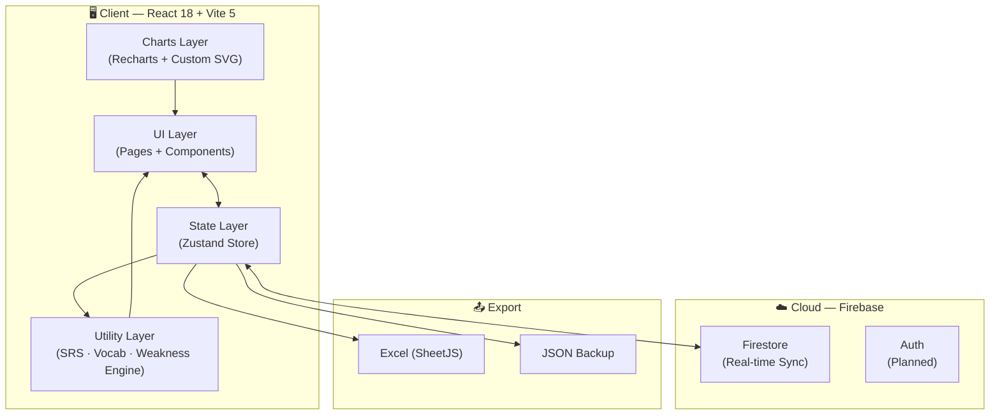
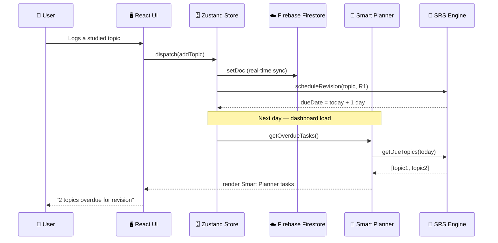
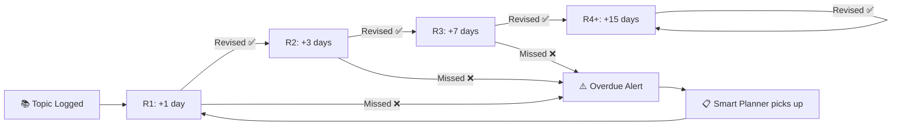
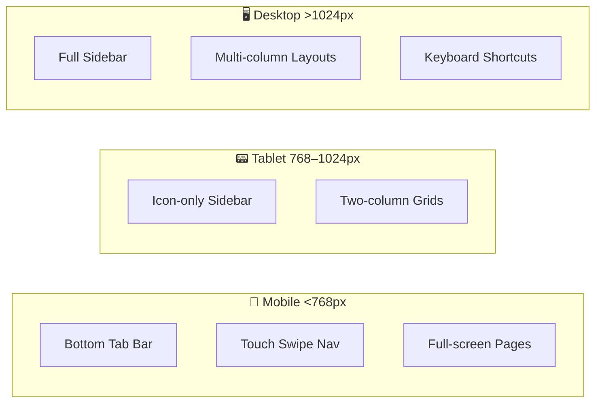

```
███████╗███████╗██████╗  ██████╗ ██╗  ██╗ ██████╗ ██╗   ██╗██████╗
╚══███╔╝██╔════╝██╔══██╗██╔═══██╗██║  ██║██╔═══██╗██║   ██║██╔══██╗
  ███╔╝ █████╗  ██████╔╝██║   ██║███████║██║   ██║██║   ██║██████╔╝
 ███╔╝  ██╔══╝  ██╔══██╗██║   ██║██╔══██║██║   ██║██║   ██║██╔══██╗
███████╗███████╗██║  ██║╚██████╔╝██║  ██║╚██████╔╝╚██████╔╝██║  ██║
╚══════╝╚══════╝╚═╝  ╚═╝ ╚═════╝ ╚═╝  ╚═╝ ╚═════╝  ╚═════╝ ╚═╝  ╚═╝
```

<div align="center">

### **Prepare Smart. Perform at Zero Hour.**

*AI-powered defence exam preparation for CDS · AFCAT · NDA aspirants*

<br/>

[](https://zerohour-pvg.vercel.app)
[](#)
[](#)
[](#)
[](#)
[](#)
[](#)
[](#)

<br/>

> **Zero Hour** — *the decisive moment where preparation meets performance.*

</div>

---

## 📌 Table of Contents

- [What is ZeroHour?](#-what-is-zerohour)
- [Live Demo](#-live-demo)
- [Feature Suite](#-feature-suite)
- [App Architecture](#-app-architecture)
- [Tech Stack](#-tech-stack)
- [Project Structure](#-project-structure)
- [Data Flow](#-data-flow)
- [Getting Started](#-getting-started)
- [Environment Variables](#-environment-variables)
- [Keyboard Shortcuts](#%EF%B8%8F-keyboard-shortcuts)
- [Responsive Design](#-responsive-design)
- [Deployment](#%EF%B8%8F-deployment)
- [Spaced Repetition Algorithm](#-spaced-repetition-algorithm)
- [Roadmap](#%EF%B8%8F-roadmap)
- [Author](#-author)

---

## ⬡ What is ZeroHour?

ZeroHour is a **personal, all-in-one command centre** for defence exam aspirants. It replaces scattered notes, spreadsheets, and revision apps with a single intelligent platform that tracks everything — daily logs, mock scores, vocabulary, spaced revision — and surfaces exactly what needs your attention today.

```
BEFORE ZEROHOUR                          WITH ZEROHOUR
─────────────────────────────────────    ─────────────────────────────────────
📒 Paper notes                    →      📊 Dashboard with live insights
📊 Scattered Excel sheets         →      🔄 Unified Spaced Revision System
📱 Multiple apps                  →      🖥 Single command centre
❌ No progress tracking           →      📈 Analytics + Mock Analysis
❌ Forgot what to revise          →      🧠 Smart Planner auto-generates tasks
❌ Vocab lost in notebooks        →      📖 120+ word engine + quiz system
```

> Built to be used **every single day**. Not once a week, not before exam season — **every day**.

---

## 🌐 Live Demo

<div align="center">

| Platform | URL | Status |
|----------|-----|--------|
| **Vercel** | [zerohour-pvg.vercel.app](https://zerohour-pvg.vercel.app) | ✅ Active |
| **Netlify** | [zerohour.netlify.app](https://zerohour.netlify.app) | ✅ Active |

</div>

---

## ✦ Feature Suite

ZeroHour ships with **13 fully integrated modules**:

```
┌─────────────────────────────────────────────────────────────────────────────┐
│                         ZEROHOUR MODULE MAP                                 │
├─────────────────┬─────────────────┬─────────────────┬────────────────────  │
│  📊 DASHBOARD   │  📅 DAILY LOG   │  🔥 HABITS      │  📚 SYLLABUS        │
│  Command Centre │  Study Diary    │  Heatmap Track  │  Topic Checkboxes   │
├─────────────────┼─────────────────┼─────────────────┼────────────────────  │
│  📝 MOCK TEST   │  🔄 REVISION    │  📖 VOCABULARY  │  🧠 QUIZ ENGINE     │
│  Score Analysis │  Spaced SRS     │  120+ Words     │  Weekly MCQs        │
├─────────────────┼─────────────────┼─────────────────┼────────────────────  │
│  ⏱ POMODORO    │  📋 PLANNER     │  📊 ANALYTICS   │  ⚙ SETTINGS        │
│  Focus Timer    │  Smart Tasks    │  Deep Insights  │  Cloud Sync         │
└─────────────────┴─────────────────┴─────────────────┴────────────────────  │
                                                                              │
└─────────────────────────────────────────────────────────────────────────────┘
```

### 📊 Command Dashboard
Real-time overview of your entire preparation at a glance:

- ⏳ Exam countdown timers — **CDS I · CDS II · AFCAT · NDA**
- 🍩 Subject-wise progress donut charts
- 📈 Mock score trend chart
- 🚨 Revision overdue alerts
- 📋 Today's plan preview
- 📅 7-day habit bar chart

---

### 📅 Daily Log
Your preparation diary, structured for accountability:

| Field | Options |
|-------|---------|
| Wake / Sleep time | Time picker |
| Energy level | 1–5 scale |
| Topics logged | Maths · English · GS |
| PYQs done | Count input |
| Mock score | Percentage |
| Toggles | Gym · Mock · Revision |
| Notes | Free text |
| Tomorrow's plan | Free text |

---

### 🔥 Habit Tracker
Six core habits — tracked daily, visualised over 30 days:

```
HABIT GRID (sample 7-day view)
                  Mon  Tue  Wed  Thu  Fri  Sat  Sun
Morning Study      ✅   ✅   ✅   ❌   ✅   ✅   ✅
Night Study        ✅   ✅   ❌   ✅   ✅   ✅   ❌
PYQ Practice       ✅   ❌   ✅   ✅   ❌   ✅   ✅
Mock / Revision    ❌   ✅   ✅   ✅   ✅   ❌   ✅
Gym                ✅   ✅   ✅   ✅   ❌   ✅   ✅
Sleep Before 12    ✅   ❌   ✅   ✅   ✅   ✅   ❌

Completion Rate    83%  67%  83% 100%  67%  83%  67%
```

---

### 📚 Syllabus Tracker
Complete CDS / AFCAT syllabus built-in — **50+ topics**:

| Subject | Topics | Features |
|---------|--------|----------|
| **Mathematics** | 20 | Subtopic checkboxes + confidence 1–5 |
| **English** | 15 | Status: Not Started → In Progress → Done |
| **General Studies** | 10 | One-tap ADVANCE to next stage |
| **AFCAT Specific** | 5+ | Full AFCAT expansion |

---

### 📝 Mock Analysis
Every test dissected for maximum insight:

```
MOCK ENTRY STRUCTURE
─────────────────────────────────────────
  Section Scores:  Maths / English / GS
  Error Types:     Silly Errors  vs  Concept Gaps
  Weak Areas:      Auto-tagged by subject
  Key Takeaway:    Personal note
  Charts:          Score trend + Target gap
```

---

### 🔄 Spaced Revision System
Never forget a topic again with the built-in SRS:

```
REVISION CYCLE FLOW
─────────────────────────────────────────────────────────────
Topic Added  →  R1 (1 day)  →  R2 (3 days)  →  R3 (7 days)  →  R4+ (15 days)
     │                │               │                │                │
   NEW            Due Today         Due +3           Due +7          Mastered
```

- ⚠️ Auto-detection of **overdue topics**
- 🔔 Dashboard alerts with days-late count
- ⚙️ Configurable intervals per round

---

### 📖 Vocabulary Engine
120+ pre-loaded defence exam words with full automation:

```
WORD CARD STRUCTURE
──────────────────────────────────
  Word:         TENACIOUS
  Meaning:      Holding firmly; persistent
  Hindi:        दृढ़
  Synonyms:     Persistent · Resolute · Steadfast
  Antonyms:     Yielding · Weak · Vacillating
  Example:      "The tenacious soldier refused to retreat."
  SRS Status:   R2 — Due in 3 days
  Tag:          ⭐ Important
```

---

### 🧠 Weekly Quiz System
Automated MCQ practice drawn from your own vocab bank:

| Type | Description |
|------|-------------|
| Synonym | Pick the closest meaning |
| Antonym | Choose the opposite |
| Meaning | Identify the correct definition |
| Idioms | Phrase interpretation |

---

### ⏱ Pomodoro Focus Timer
Structured deep work with full session analytics:

```
FOCUS SESSION
┌─────────────────────────────┐
│      ● ZEROHOUR FOCUS       │
│                             │
│        ╔═══════╗            │
│        ║ 23:47 ║            │
│        ╚═══════╝            │
│                             │
│  Topic: Chapter 3 — Maths  │
│  Today: 4h 20m total       │
│  ████████░░  7-day bar     │
└─────────────────────────────┘
```

---

### 📋 Smart Planner
Auto-generates your daily task list from:

1. 🚨 **Overdue revision topics** (highest priority)
2. 🧠 **Quiz-identified weak areas**
3. 📖 **Vocabulary revision due**
4. 📚 **High-priority unstarted topics**
5. 🔄 **In-progress topics to continue**

---

### 📊 Analytics
Deep performance insights across all modules:

```
ANALYTICS DASHBOARD — METRICS TRACKED
──────────────────────────────────────────────────────────────
  📈 Quiz accuracy trend          (line chart, 30-day)
  📊 Subject-wise accuracy        (bar chart: Maths/English/GS)
  🥧 Mistake type breakdown       (pie: silly vs concept gaps)
  📈 Mock score trend vs target   (line + target overlay)
  📚 Syllabus completion %        (per subject)
  ⚠️ Weak areas summary           (all topics < 60% accuracy)
```

---

## 🏗 App Architecture



---

## 🏗 Tech Stack

| Layer | Technology | Version | Purpose |
|-------|------------|---------|---------|
| **Framework** | React | 18 | UI component system |
| **Build Tool** | Vite | 5 | Fast dev server + build |
| **State** | Zustand | 5 | Global state, zero boilerplate |
| **Cloud Sync** | Firebase Firestore | v9 | Real-time cross-device sync |
| **Charts** | Recharts + Custom SVG | — | Analytics + dashboard charts |
| **Styling** | Tailwind CSS v4 + Custom CSS | v4 | Utility + bespoke dark theme |
| **Export** | SheetJS (xlsx) | — | Excel export / import |
| **Deployment** | Vercel + Netlify | — | Auto-deploy on push |
| **Fonts** | Orbitron · Share Tech Mono · Rajdhani | — | Brand typography |

```
LANGUAGE BREAKDOWN

  JavaScript  ████████████████████████████░░░  90.4%
  CSS         ██████░░░░░░░░░░░░░░░░░░░░░░░░░   9.2%
  HTML        █░░░░░░░░░░░░░░░░░░░░░░░░░░░░░░   0.4%
```

---

## 📁 Project Structure

```
zerohour/
│
├── 📄 index.html                   # Entry point — splash screen, meta tags
├── ⚙️  vite.config.js
├── 🔧 netlify.toml
├── 🔒 .env                         # Firebase credentials (NOT committed)
│
└── src/
    ├── 🚀 App.jsx                  # Root — routing, swipe nav, keyboard shortcuts
    ├── 🎯 main.jsx                 # React entry + console branding
    ├── 🎨 index.css                # Global styles, CSS variables, ZeroHour theme
    ├── 📊 data.js                  # Syllabus, exam data, tab config, constants
    ├── 📈 Charts.jsx               # Custom SVG charts (Donut, Line, Bar)
    ├── 🔔 Toast.jsx                # Notification system
    ├── 💬 Modal.jsx                # Confirm dialog system
    │
    ├── components/
    │   ├── Header.jsx              # Top bar — brand mark, clock, sync status
    │   ├── Nav.jsx                 # Sidebar (desktop) + bottom nav (mobile)
    │   ├── Button.jsx              # Reusable button
    │   └── Card.jsx                # Reusable card
    │
    ├── pages/
    │   ├── 📊 Dashboard.jsx        # Command centre overview
    │   ├── 📅 DailyLog.jsx         # Daily study diary
    │   ├── 🔥 Habits.jsx           # Habit tracker + heatmap
    │   ├── 📚 Syllabus.jsx         # Full syllabus tracker
    │   ├── 📝 Mocks.jsx            # Mock test logger + analysis
    │   ├── 📋 PYQLog.jsx           # PYQ session tracker
    │   ├── 🔄 Revision.jsx         # Spaced revision system
    │   ├── ⏱  Pomodoro.jsx         # Focus timer
    │   ├── 📖 Vocab.jsx            # Vocabulary bank
    │   ├── 🧠 Quiz.jsx             # Weekly quiz engine
    │   ├── 📋 Planner.jsx          # Smart daily planner
    │   ├── 📊 Analytics.jsx        # Performance analytics
    │   └── ⚙️  Settings.jsx         # Config + about + data management
    │
    ├── store/
    │   └── 🗄️  useStore.js          # Zustand store + Firebase sync logic
    │
    ├── utils/
    │   ├── 📅 dateUtils.js          # Date formatting, streak calc
    │   ├── 🔄 spacedRepetition.js   # SRS algorithm + due-date logic
    │   ├── 🧠 weaknessEngine.js     # Accuracy analysis, weak area detection
    │   ├── 📖 vocabEngine.js        # Synonym/antonym generation, idioms bank
    │   └── 📚 initialVocab.js       # 120+ pre-loaded defence vocabulary
    │
    └── services/
        └── 📤 excelService.js       # SheetJS export / import
```

---

## 🔀 Data Flow



---

## 🚀 Getting Started

### Prerequisites

- Node.js ≥ 18
- npm or yarn
- A Firebase project with Firestore enabled

### Installation

```bash
# 1. Clone the repository
git clone https://github.com/PurvagiriGoswami/ZeroHour.git
cd ZeroHour

# 2. Install dependencies
npm install

# 3. Set up environment variables
cp .env.example .env
# Open .env and fill in your Firebase config keys

# 4. Start the development server
npm run dev

# 5. Open your browser at:
#    http://localhost:5173
```

### Build for Production

```bash
npm run build
# ✅ Output in /dist — ready to deploy
```

### Preview Production Build

```bash
npm run preview
# Spins up a local server serving the /dist build
```

---

## 🔒 Environment Variables

Create a `.env` file in the project root with your Firebase project credentials:

```env
VITE_FB_API_KEY=your_api_key
VITE_FB_AUTH_DOMAIN=your_project.firebaseapp.com
VITE_FB_PROJECT_ID=your_project_id
VITE_FB_STORAGE_BUCKET=your_project.appspot.com
VITE_FB_MESSAGING_SENDER_ID=your_sender_id
VITE_FB_APP_ID=your_app_id
VITE_FB_MEASUREMENT_ID=G-XXXXXXXXXX
```

> ⚠️ **Never commit `.env` to Git.** It is already listed in `.gitignore`.

To get these values:
1. Go to [Firebase Console](https://console.firebase.google.com)
2. Create or select a project
3. Go to **Project Settings → General → Your apps → Web app**
4. Copy the `firebaseConfig` object values

---

## 🔄 Spaced Repetition Algorithm

ZeroHour uses a **custom SRS (Spaced Repetition System)** inspired by SM-2:

```
REVISION SCHEDULE
─────────────────────────────────────────────────────────────────────
Round    Interval     Trigger Condition
─────────────────────────────────────────────────────────────────────
  R1     +1 day       Topic first logged
  R2     +3 days      R1 completed ✅
  R3     +7 days      R2 completed ✅
  R4+    +15 days     R3+ completed ✅ (repeats)
─────────────────────────────────────────────────────────────────────
Overdue  Alert fires  if today > dueDate
Dashboard shows days-late count per topic
```



---

## ⌨️ Keyboard Shortcuts

Navigate the entire app without touching your mouse:

| Key | Page | Key | Page |
|-----|------|-----|------|
| `1` | 📊 Dashboard | `6` | 📋 PYQ Log |
| `2` | 📅 Daily Log | `7` | 🔄 Revision |
| `3` | 🔥 Habits | `8` | ⏱ Pomodoro |
| `4` | 📚 Syllabus | `9` | 📖 Vocabulary |
| `5` | 📝 Mocks | `0` | 🧠 Quiz |

> 📱 On mobile — **swipe left / right** to navigate between pages.

---

## 📱 Responsive Design

ZeroHour is fully responsive across all screen sizes:

```
BREAKPOINT STRATEGY
──────────────────────────────────────────────────────────────────
  Mobile      < 768px     Bottom tab bar · full-screen pages · touch swipe
  Tablet      768–1024px  Icon-only sidebar · two-column grids
  Desktop     > 1024px    Full labelled sidebar · multi-column layouts
  Wide        > 1440px    Expanded content with generous padding
──────────────────────────────────────────────────────────────────
```



---

## ☁️ Deployment

ZeroHour auto-deploys to both Vercel and Netlify on every push to `main`.

### Vercel (Primary)

```bash
# Install Vercel CLI
npm i -g vercel

# Deploy
vercel --prod
```

### Netlify (Secondary)

Config via `netlify.toml`:

```toml
[build]
  command = "npm run build"
  publish = "dist"

[[redirects]]
  from = "/*"
  to = "/index.html"
  status = 200
```

### CI/CD Flow

```
git push origin main
       │
       ▼
  GitHub Repo
  ┌────┴────┐
  │         │
Vercel   Netlify
  │         │
Build    Build
  │         │
Deploy   Deploy
  │         │
  └────┬────┘
       │
  Live in ~60s
```

---

## 🗺️ Roadmap

```
ZEROHOUR ROADMAP
─────────────────────────────────────────
  v7.0 (Current)
  ✅  13 fully integrated modules
  ✅  Firebase real-time sync
  ✅  Excel + JSON export/import
  ✅  120+ vocabulary engine
  ✅  Custom SRS algorithm
  ✅  Vercel + Netlify deployment

  v8.0 (Planned)
  🔲  Google / Phone SSO authentication
  🔲  Multi-user support with data isolation
  🔲  Offline PWA mode + service worker
  🔲  Push notifications for revision reminders

  v9.0 (Future)
  🔲  AI-generated study schedule from exam date
  🔲  PDF monthly performance report export
  🔲  NDA full syllabus expansion
  🔲  Dark / light theme toggle
─────────────────────────────────────────
```

---

## 📊 Module Feature Matrix

| Module | Charts | SRS | Firebase Sync | Export | Mobile |
|--------|--------|-----|---------------|--------|--------|
| Dashboard | ✅ | ✅ | ✅ | — | ✅ |
| Daily Log | — | — | ✅ | ✅ | ✅ |
| Habits | ✅ | — | ✅ | — | ✅ |
| Syllabus | ✅ | ✅ | ✅ | — | ✅ |
| Mock Analysis | ✅ | — | ✅ | ✅ | ✅ |
| Revision | ✅ | ✅ | ✅ | ✅ | ✅ |
| Vocabulary | — | ✅ | ✅ | ✅ | ✅ |
| Quiz | ✅ | ✅ | ✅ | ✅ | ✅ |
| Pomodoro | ✅ | — | ✅ | — | ✅ |
| Planner | — | ✅ | ✅ | — | ✅ |
| Analytics | ✅ | — | ✅ | — | ✅ |
| Settings | — | — | ✅ | ✅ | ✅ |

---

## 👨‍💻 Author

<div align="center">

**Purvagiri Goswami**
Designer · Developer · Defence Aspirant

[](https://github.com/PurvagiriGoswami)
[](https://zerohour-pvg.vercel.app)

> *Built ZeroHour as a personal tool. Made it production-grade.*

</div>

---

## 📄 License

Personal and educational use only.
Redistribution or commercial use is **not permitted** without explicit written permission from the author.

---

<div align="center">

**ZeroHour © 2026 · All rights reserved**

*"The more you sweat in peace, the less you bleed in war."*

`PREPARE SMART. PERFORM AT ZERO HOUR.`

</div>
